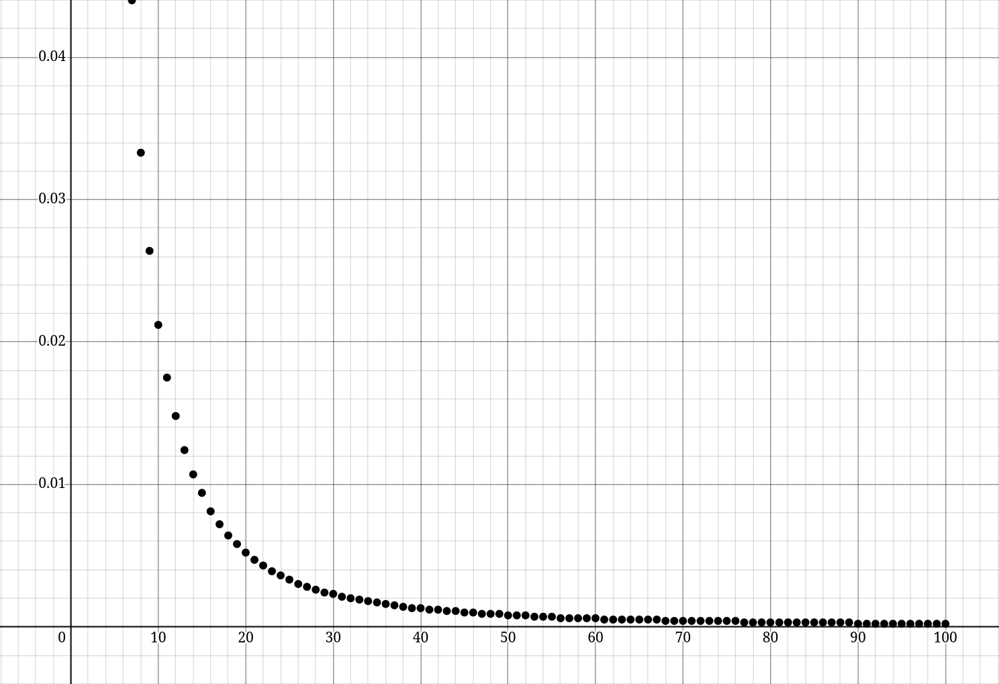
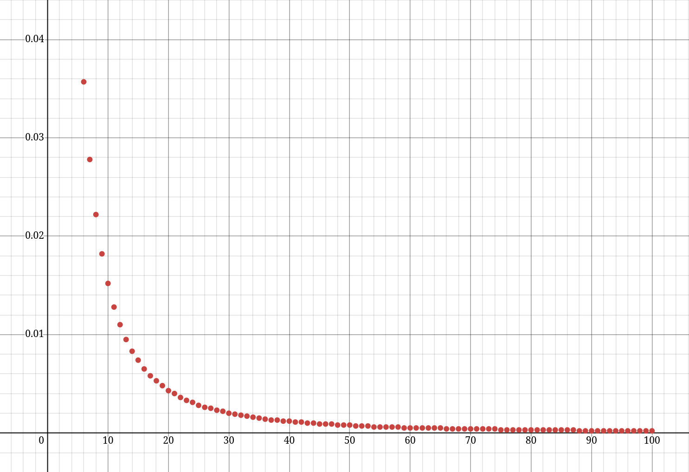
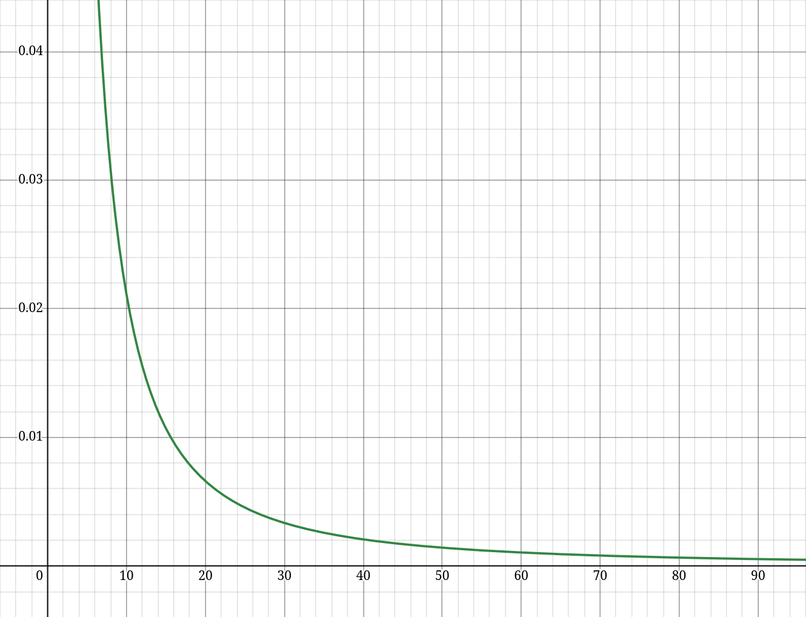

# Звіт: Програмний експеримент (Задача 8)

## 1. Мета експерименту
Відповідно до умови задачі, необхідно було дослідити, як залежить відношення середнього та медіанного розмірів стрічки кісток до загальної кількості кісток у наборі від значення параметра $n$.

## 2. Методологія
Я розробив програму що симулює роздачу кісток доміно. Вона має два режими: Звичайний - досліджує для фіксованого $n$, Долідницький - досліджує для $n$:$\small\overline{0,100}$. Експеримент для зручності проводився в дослідницькому режимі. На кожне значення $n$ робилось по $10\,000$ роздач. Після рахувались відношення та виводились в красивій таблиці.Загальну кількість кісток для кожного $n$ обчислювали за формулою:
$$ \text{Total} = \frac{(n + 1)(n + 2)}{2} $$

## 3. Результати дослідження
Після отримання данних я їх систематизував та створив графіки за допомогою Desmos. На отриманих графіках чітко видно динаміку відношень:

### Відношення середнього до загальної кількості кісток

### Відношення медіани до загальної кількості кісток

Можемо побачити на графіках що обидва показники **монотонно спадають**, наближаючись до 0 при великих $n$.

## 4. Аналітичний висновок
Оскільки елеменетарною подією для для нашого експерименту є витягування однієї випадкової кістки то |$\Omega$| = $\frac{(n + 1)(n + 2)}{2}$ = $\frac{n^2}{2}$. 
Нехай маємо множину подій А - витягання кістки що можна розмістити на столі. |A| - кіслькість таких сприятливих наслідків буде приблизно дорівнювати 2n адже ми маємо n+1 кісток для кожного числа. Оскільки ми вже маємо одну кістку з данними числами на столі то кількість таких буде n для кожного кінця послідовності. Тобто загалом 2n (бо кінця два, очевидно). Тобто |A| $\approx$ 2n.
Отже P(A) = $\frac{|A|}{|\Omega|}$ = $\frac{2n}{\frac{n^2}{2}}$ = $\frac{4}{n}$.
Оскільки $\lim_{n \to \infty}{P(A)}$ = $\lim_{n \to \infty}{\frac{4}{n}}$ = 0, то можемо побачити що на великих $n$ в середньому ми матимемо довжину стрічки $\approx$ 1 (запамятаємо це значення як L). З цього маємо фунцію y = $\frac{L}{|\Omega|}$ = $\frac{1}{\frac{n^2}{2}}$ = $\frac{2}{n^2}$. А це в нас **степенева регресія** (**обернено-квадратична залежність**)

